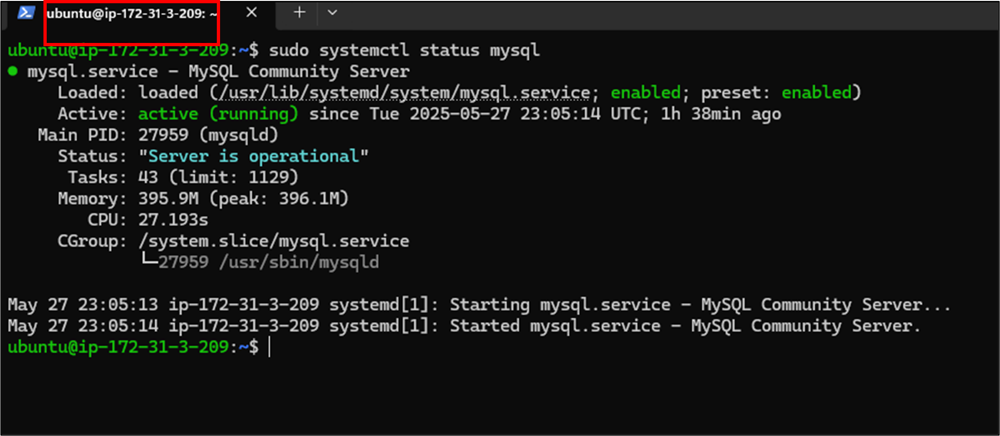
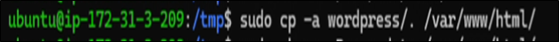
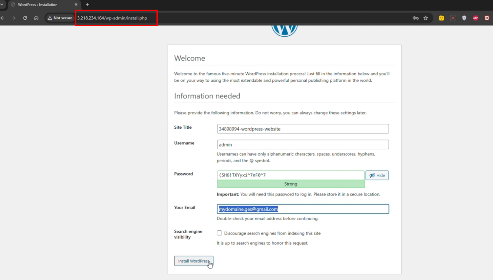

# WordPress Deployment on AWS EC2 - Complete Guide

**👨‍💻 Author Information**

**Name:** Muhammad Ahsan  
**Student ID:** 34898994  
**GitHub Repository:** wp-installation-automation  
**ICT171 Project Video Explainer link** https://drive.google.com/file/d/1Jhz08MIhtupi3rE8O8z2sfE0__0u4VQr/view?usp=sharing
**IP address** 3.218.234.164
**🚀 Live Demo**

Experience the fully deployed WordPress website with SSL security and custom domain integration:  
**🌐 Live Website:** https://muhammad34898994.zapto.org

## I. Project Overview

This project demonstrates the end-to-end deployment of a fully functional, secure, and publicly accessible WordPress website hosted on AWS EC2. It is designed to simulate a real-world cloud infrastructure setup for small businesses or personal portfolios using cost-effective and scalable technologies.

The implementation spans infrastructure provisioning, server configuration, content management setup, automation scripting, domain integration, and HTTPS security. Every step reflects modern DevOps principles and cloud best practices, providing a hands-on demonstration of deploying web applications in a production-ready environment.

### Key Deliverables:
- Provisioned EC2 Instance (Ubuntu Server) with public access via Elastic IP
- Installed & Secured LAMP Stack (Linux, Apache, MySQL, PHP)
- Deployed WordPress CMS with functional theme and content
- Automated Setup Script hosted on GitHub for one-line deployment
- Custom Domain mapped using a free dynamic DNS (No-IP)
- SSL Secured Website using Let's Encrypt and Certbot
- Live Online Website available at: https://muhammad34898994.zapto.org

### Educational & Technical Objectives:
- Learn and apply cloud provisioning with AWS EC2
- Practice secure Linux server setup and updates
- Understand manual and scripted WordPress deployment
- Integrate DNS and dynamic IP resolution using a free provider
- Implement SSL/TLS certificates for HTTPS
- Gain foundational DevOps automation skills

This project highlights not only infrastructure setup, but also a focus on maintainability, repeatability, and cost-efficiency — reflecting real-world cloud engineering demands.

## II. Github View

For this project, my personal GitHub account was used under the username muhammadahsan34898994, as shown in the image below.


Within this account, a dedicated repository was created named wp-installation-automation. The goal of this repository is to host all related assets 

GitHub Repository URL: https://github.com/muhammadahsan34898994/wp-installation-automation


### 1. Repository Contents

**Script File:** install-wordpress.sh
Automates downloading, configuring, and setting up WordPress

**Open Access:** Public repo URL for review, reuse, and collaboration


### 2. Commit History

The GitHub commit history documents the evolution of the script and provides full transparency into how the repository was developed. Each commit reflects a change or improvement made to the project, including bug fixes, enhancements, and refinements to automation. This history demonstrates active project development, attention to detail, and iterative improvement — all key practices in software development and DevOps workflows.


## III. Deployment Steps

### 1. Create Linux based EC2

Before any deployment steps were executed, a Linux-based EC2 instance (Ubuntu Server) was created using the AWS Management Console. This instance serves as the hosting environment for the entire WordPress stack. The following choices and configurations were made during instance creation:

**AMI:** Ubuntu Server 22.04 LTS (free tier eligible)


**Instance Type:** t2.micro (suitable for lightweight workloads and free tier usage)


**Storage:** 20 GB EBS volume

**Security Group:** Custom rules allowing inbound traffic on ports 80 (HTTP), 443 (HTTPS), and 22 (SSH)


**Elastic IP:** Allocated and attached to provide a static public IP address


### 2. Server preparation

This phase involves preparing the Ubuntu-based EC2 instance with all necessary system updates and software packages.

Note: the private ip address of the used EC2 is 172.31.3.209


#### System Update

```bash
sudo apt update && sudo apt upgrade -y
```

Purpose: Updates the package list and installs the latest versions of packages and security patches.
Expected Output: List of updated packages with confirmation messages like "packages upgraded successfully."


#### Install Apache Web Server

```bash
sudo apt install apache2 -y
```

Purpose: Installs the Apache2 web server, which will handle HTTP requests for WordPress.
Expected Output: Confirmation that Apache has been installed.
Test: run the command 'sudo systemctl status apache2'


#### Install PHP and Required Extensions

```bash
sudo apt install php libapache2-mod-php php-mysql -y
```

Purpose: Installs PHP and the necessary extensions to allow Apache to process PHP files and connect to MySQL.
Expected Output: Confirmation of PHP version and modules installed.

Test: run the command 'php -v'


#### Install MySQL Database Server

```bash
sudo apt install mysql-server -y
```

Purpose: Installs the MySQL server, which will be used as the database engine for WordPress.
Test: run the command 'sudo systemctl status mysql'



#### Secure MySQL Installation

```bash
sudo mysql_secure_installation
```

Purpose: Launches a guided script to improve MySQL security (removes test databases, disables remote root access, etc.).
Expected Output: Series of questions with confirmation that security settings were applied.

Details:

**1. Enable Validate Password Plugin**


- Prompt: "Would you like to setup VALIDATE PASSWORD component?"
- Answer Chosen: y
- Purpose: Enforces password complexity rules for any users created later.
- Why It Matters: Helps prevent weak or easily guessable passwords.

**2. Password Validation Policy**


- Prompt: "Please enter 0 = LOW, 1 = MEDIUM and 2 = STRONG"
- Answer Chosen: 2 (STRONG)
- Purpose: Enforces strict requirements — mixed case, numbers, special chars, and dictionary checks.
- Why It Matters: Maximizes security for database accounts.

**3. Remove Anonymous Users**


- Prompt: "Remove anonymous users?"
- Answer Chosen: y
- Purpose: Eliminates users who can connect to MySQL without authentication.
- Why It Matters: Reduces attack surface.

**4. Disallow Remote Root Login**


- Prompt: "Disallow root login remotely?"
- Answer Chosen: y
- Purpose: Restricts root login to localhost only.
- Why It Matters: Prevents brute-force or remote compromise attempts on root account.

**5. Remove Test Database**


- Prompt: "Remove test database and access to it?"
- Answer Chosen: y
- Purpose: Deletes a default test database that anyone can access.
- Why It Matters: Ensures no sample or unused database is exposed.

**6. Reload Privileges**


- Prompt: "Reload privilege tables now?"
- Answer Chosen: y
- Purpose: Applies all the security changes immediately.
- Why It Matters: No need to restart MySQL or wait for settings to take effect.

Result: The database is now locked down and ready for secure use with WordPress.

#### Create WordPress Database and User

```bash
sudo mysql
```

Then inside the MySQL shell:

```sql
CREATE DATABASE wordpress DEFAULT CHARACTER SET utf8 COLLATE utf8_unicode_ci;
CREATE USER 'wpuser'@'localhost' IDENTIFIED BY 'StrongP@ssw0rd!';
GRANT ALL PRIVILEGES ON wordpress.* TO 'wpuser'@'localhost';
FLUSH PRIVILEGES;
EXIT;
```

Purpose: Creates a dedicated database and user for WordPress, improving security and isolation.


### 3. Wordpress configuration

This phase covers downloading, configuring, and automating the WordPress deployment.

#### Download and Extract WordPress

```bash
cd /tmp
curl -O https://wordpress.org/latest.tar.gz
tar xzvf latest.tar.gz
```

Purpose: Downloads the latest WordPress archive and extracts it for setup


#### Copy WordPress Files to Web Root

```bash
sudo cp -a wordpress/. /var/www/html/
```

Purpose: Moves all WordPress core files to the Apache web root.



#### Set Permissions

```bash
sudo chown -R www-data:www-data /var/www/html/
sudo chmod -R 755 /var/www/html/
```

Purpose: sets correct ownership and permissions for WordPress.


#### Clean Up

```bash
sudo rm -rf /var/www/html/index.html
```

Purpose: Removes Apache's default page


#### Configure WordPress

```bash
cd /var/www/html/
sudo mv wp-config-sample.php wp-config.php
sudo nano wp-config.php
```

Purpose: Inside the file, update the following:

```php
define( 'DB_NAME', 'wordpress' );
define( 'DB_USER', 'wpuser' );
define( 'DB_PASSWORD', 'pass@10Dnj' );
define( 'DB_HOST', 'localhost' );
```


#### Restart Apache

```bash
sudo systemctl restart apache2
```

Purpose: Reloads Apache to apply all new configurations.


#### Verify Installation

Check the http://<ipaddressofEC2>



### 4. Domaine name and SSL certificate

#### Configure Free Dynamic Domain (No-IP)

Registered domain: muhammad34898994.zapto.org
Mapped domain to the EC2 public IP using No-IP dynamic DNS dashboard


#### Install Certbot (Let's Encrypt)

```bash
sudo apt install certbot python3-certbot-apache -y
```

Purpose: Installs Certbot, a tool for issuing free SSL certificates via Let's Encrypt.


#### Generate and Install SSL Certificate

To secure the deployed WordPress website with HTTPS, Let's Encrypt SSL was configured using the following command:

```bash
sudo certbot --apache -d muhammad34898994.zapto.org
```

This command triggers Certbot to automatically configure SSL for the specified domain and update Apache's configuration.

**Step 1: Provide Email Address**


Certbot prompts for an email address to:
- Send expiration/renewal reminders.
- Provide urgent security notices.

Input Used: mydomaine.ges@gmail.com

This ensures you're notified before the SSL certificate expires (Let's Encrypt certificates are valid for 90 days).

**Step 2: Agree to Terms of Service**


Certbot displays its Terms of Service. You must agree to continue.
Choice Made: Y
Accepting registers you with the ACME server and enables Certbot to issue certificates.

**Step 3: Email Sharing Consent (Optional)**


Certbot asks if you want to share your email with the EFF (a Let's Encrypt partner) to receive digital freedom news.
Choice Made: Y
While optional, this helps support the open-source community behind the tool.

#### Final Output: Certificate Issued and HTTPS Enabled


Certbot then:
- Generates an SSL certificate.
- Installs it under:
  - `/etc/letsencrypt/live/muhammad34898994.zapto.org/fullchain.pem` (certificate)
  - `/etc/letsencrypt/live/muhammad34898994.zapto.org/privkey.pem` (private key)
- Automatically updates Apache to serve HTTPS.

Final Message: Congratulations! You have successfully enabled HTTPS on https://muhammad34898994.zapto.org

## IV. Script Explanation

### 1. Purpose and Motivation

The goal of the automation script is to streamline the deployment process of WordPress by consolidating all the repetitive manual commands into a single executable file. This enhances:

- **Efficiency:** Automates what would normally take several minutes.
- **Repeatability:** Ensures consistency across environments.
- **Scalability:** Can be reused for future deployments with minimal changes like password

The script replicates all the essential manual steps used in a standard WordPress installation. Instead of copying/pasting each command line-by-line, this script performs the entire setup in one go.

### 2. Script Location

The script is publicly hosted on GitHub:
URL: https://github.com/muhammadahsan34898994/wp-installation-automation/blob/main/install-wordpress.sh


### 3. How the Script Works (Step-by-Step)

**1) Download WordPress**

```bash
echo "Downloading WordPress..."
cd /tmp
curl -O https://wordpress.org/latest.tar.gz
```

Changes to the temporary directory and downloads the latest WordPress archive from the official source.

**2) Extract WordPress**

```bash
tar -xzf latest.tar.gz
```

Extracts the downloaded .tar.gz file to a folder named wordpress.

**3) Clean /var/www/html**

```bash
echo "Cleaning /var/www/html/..."
sudo rm -rf /var/www/html/*
```

Removes any existing files in the web root directory to avoid conflicts.

**4) Move WordPress Files**

```bash
echo "Copying WordPress files to /var/www/html/..."
sudo cp -a wordpress/. /var/www/html/
```

Copies all WordPress files into Apache's root folder (/var/www/html).

**5) Remove Temporary Files**

```bash
echo "Cleaning up temporary files..."
rm -rf /tmp/wordpress /tmp/latest.tar.gz
```

Cleans up the downloaded archive and extracted folder to save space.

**6) Set Permissions**

```bash
echo "Setting ownership and permissions..."
sudo chown -R www-data:www-data /var/www/html/
sudo chmod -R 755 /var/www/html/
```

Gives Apache (user: www-data) ownership of the WordPress files and sets proper directory permissions.

**7) Configure WordPress**

```bash
echo "Configuring WordPress..."
cd /var/www/html
sudo rm -f index.html
sudo mv wp-config-sample.php wp-config.php
```

Removes any default placeholder (index.html) and renames the WordPress configuration sample file.

**8) Inject Database Credentials**

```bash
sudo sed -i "s/database_name_here/wordpress/" wp-config.php
sudo sed -i "s/username_here/wpuser/" wp-config.php
sudo sed -i "s/password_here/StrongP@ssw0rd!/" wp-config.php
sudo sed -i "s/localhost/localhost/" wp-config.php
```

Replaces placeholders in wp-config.php with actual database information.

**9) Restart Apache**

```bash
echo "Restarting Apache..."
sudo systemctl restart apache2
```

Restarts the Apache web server to ensure that all changes take effect and the WordPress site is now live.

**10) Output**

```bash
echo "WordPress is installed, configured, and ready to go!"
```

Displays a success message confirming the installation is complete.

This script converts the entire WordPress setup from a 10-minute manual job into a 20-second automated task — perfect for bootstrapping, student demos, or lightweight client setups.

## V. Test Output

After developing and executing the WordPress installation script, a full test was performed to verify its effectiveness. The results confirm that the script:

- Downloads and installs WordPress correctly
- Configures the database credentials
- Sets proper file permissions
- Cleans up unnecessary files
- Restarts the Apache server
- Delivers a fully functional WordPress instance

### 1. Execution Log & Results

Command Used:

```bash
curl -s https://raw.githubusercontent.com/muhammadahsan34898994/wp-installation-automation/main/install-wordpress.sh | bash
```


Result:


### 2. Verified Output Breakdown:

| Step | Result |
|------|--------|
| WordPress downloaded | Archive fetched from official source |
| WordPress extracted | Files unpacked to /tmp/wordpress |
| Cleaned existing /var/www/html | Old content removed |
| Files copied | WordPress files moved to web root |
| Permissions set | www-data assigned as owner, permissions set to 755 |
| Config updated | wp-config.php correctly edited with DB credentials |
| Apache restarted | WordPress accessible via browse |

This successful execution confirms that the automation script performs a complete, error-free WordPress deployment — transforming a fresh EC2 instance into a production-ready CMS in minutes, without any manual intervention

## VI. Total Cost of Ownership (TCO)

This section outlines the infrastructure and service costs associated with deploying and maintaining the WordPress site. This setup was intentionally designed using free-tier eligible and open-source components to minimize cost while remaining production-capable

| Component | Service | Estimated Cost | Notes |
|-----------|---------|----------------|-------|
| EC2 Instance (t2.micro) *2 | Amazon Web Services (AWS) | 0.00 $ (Free Tier) | 750 hours/month for 12 months under AWS Free Tier |
| Elastic IP *2 | AWS | 0.00 $ (if attached) | Free as long as it's assigned to a running EC2 instance |
| Storage (EBS, 20GB) | AWS | 0.00 $ (Free Tier) | Up to 30GB under Free Tier |
| Domain Name | No-IP | 0.00 $ | Free dynamic DNS domain (e.g., zapto.org) |
| SSL Certificate | Let's Encrypt | 0.00 $ | Free SSL via Certbot |
| WordPress | Open Source | 0.00 $ | Free CMS, self-hosted |
| OceanWP Theme | Free Theme | 0.00 $ | Used free version for template import |
| Additional Software | Apache, PHP, MySQL, Certbot … | 0.00 $ | Installed via Ubuntu APT repository |
| DNS Management | No-IP / EC2 public IP mapping | 0.00 $ | Handled through dynamic DNS setup |

**Total Monthly Cost: 0.00 $**

Note: These estimates assume use of the AWS Free Tier and open-source components. After the 12-month Free Tier period, EC2 + EBS storage may incur minor monthly charges (3$-10$/month depending on usage).

## VII. Conclusion

This project successfully demonstrates how to deploy a secure, scalable, and publicly accessible WordPress site using AWS EC2, a free domain from No-IP, and open-source tools. By combining manual server setup with a one-liner automation script, the deployment process is now fast, repeatable, and easy to maintain.

The following components were configured and verified:

| Component | Description | Status |
|-----------|-------------|--------|
| EC2 + Elastic IP | Compute host with static IP address | ✅ |
| LAMP Stack | Apache (web server), PHP, and MySQL | ✅ |
| WordPress | Installed Manually and develop an automation script | ✅ |
| MYSQL DB | Dedicated database and secured user | ✅ |
| Theme | Twenty Twenty-Four | ✅ |
| Domain Name | No-IP dynamic DNS pointed to EC2 IP | ✅ |
| SSL | Let's Encrypt certificate + auto-renew | ✅ |

The final result is a live, secure website at:
https://muhammad34898994.zapto.org/

This deployment represents a complete and functional cloud-hosted WordPress environment ready for public use.

## VIII. Referencing

| URL | Usage |
|-----|-------|
| https://docs.aws.amazon.com/kinesisvideostreams/latest/dg/gs-ubuntu.html | Launching and managing EC2 instances |
| https://docs.aws.amazon.com/codedeploy/latest/userguide/tutorials-wordpress.html | Deploying WordPress on EC2 |
| https://documentation.ubuntu.com/server/ | Ubuntu server administration |
| https://httpd.apache.org/docs/ | How to use apache |
